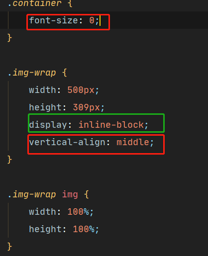

# 处理前


# 处理后


# 处理代码
```
        .container {
            font-size: 0;
        }

        .img-wrap {
            width: 500px;
            height: 309px;
            display: inline-block;
            vertical-align: middle;
        }

        .img-wrap img {
            width: 100%;
            height: 100%;
        }
```
