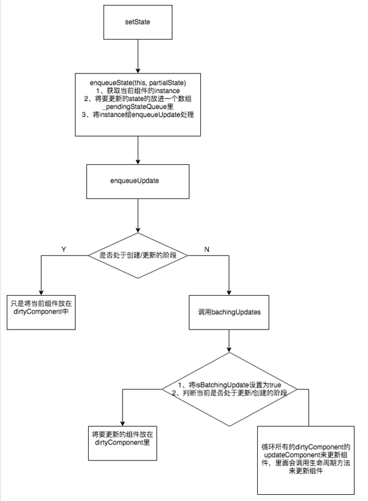

1.将setState传入的partialState参数存储在当前组件实例的state暂存队列中。
* (将要更新的state放入一个数组中，将要更新的component instance也放在一个队列里)
2.判断当前React是否处于批量更新状态，如果是，将当前组件加入待更新的组件队列中。
3.如果未处于批量更新状态，将批量更新状态标识设置为true，用事务再次调用前一步方法，保证当前组件加入到了待更新组件队列中。
* 如果当前事务正在更新过程中，则使用enqueueUpdate将当前组件放在dirtyComponent里。 2、如果当前不在更新过程的话，则执行更新事务。
4.调用事务的waper方法，遍历待更新组件队列依次执行更新。
5.执行生命周期componentWillReceiveProps。
6.将组件的state暂存队列中的state进行合并，获得最终要更新的state对象，并将队列置为空。
7.执行生命周期componentShouldUpdate，根据返回值判断是否要继续更新。
8.执行生命周期componentWillUpdate。
9.执行真正的更新，render。
10.执行生命周期componentDidUpdate。