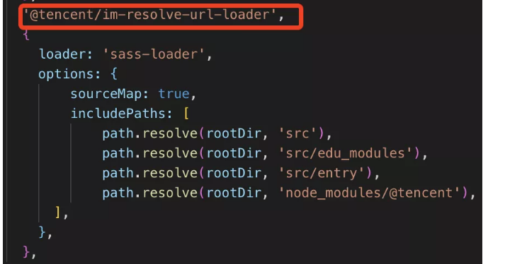

## 关于sass中url加载找不到路径报错问题
#### 场景描述：
>当你的index.scss中@import了其他scss文件（eg:a.scss），
如果a.scss里使用了url(),且里面的路径时相对路径，那么在sass-loader处理过后给css-loader处理时就会报错，找不到url路径资源。
#### 原因：
> 当sass-loader处理时，会将index.scss里的a.scss合并，最后只输出index.scss，这个时候a.scss中的url()本来是以a.scss写的相对路径
在合并的过程中又没有对url()做处理，所以导致了无法定位到url()里资源的问题
#### 解决：
* 利用css sourceMap: (不用动源码，只需修改配置)
>增加一个loader去处理，根据sourceMap的sourcesContent和url内容进行匹配，然后从sources定位到原有css资源路径，将传递给下个loader的url内容替换成绝对路径
```javascript
module.exports = function (content, map) {
    const res = content.replace(/url\((?:\'|")?((\.\/|\.\.\/)+([^\'"\)]*))(\'|")?\)/g, (str, img, p2, imgPath) => {
        let index = -1;
        const {sourcesContent = [], sources = [], sourceRoot = []} = map || {};
        sourcesContent.some((item, i)=> {
            if (item.indexOf(img) !== -1) {
                index = i;
                return true;
            }
        });
        if (index !== -1) {
            const dir = path.dirname(sources[index]); // 获取文件所在目录
            str = str.replace(img, `~${path.join(dir, img)}`);
        }
        return str;
    });
    this.callback(null, res, map);
    return;
}
```
>
* 使用resolve-url-loader,设置于loader链中的sass-loader之前，就可以重写url,但是，resolve-url-loader不识别scss文件的行内注释语法`//注释` 所以如果在接入公共样式库的时候会有一些问题。
* 通过alias设置路径别名，使用绝对路径。在scss文件中使用alias里定义的路径别名时，需带上~前缀，不然后被识别为普通路径
* 将资源路径改为变量统一管理

#### [参考链接](https://mp.weixin.qq.com/s/j3jVPNgg4WCnI7RBJTxktA)